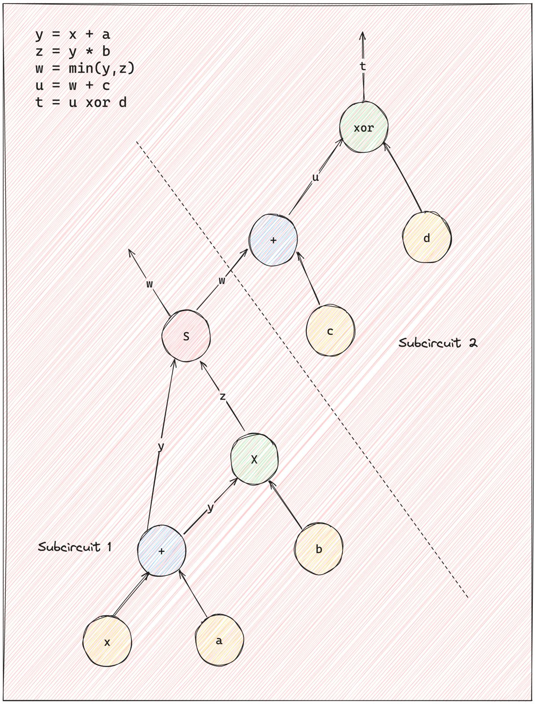

## Distributed proof generation PoC

This repository contains code to distribute the generation of ZK proof ([zksync era-boojum](https://github.com/matter-labs/era-boojum)) to `M` machines.

### The circuit

The following is an illustration of the arithmetic circuit:

